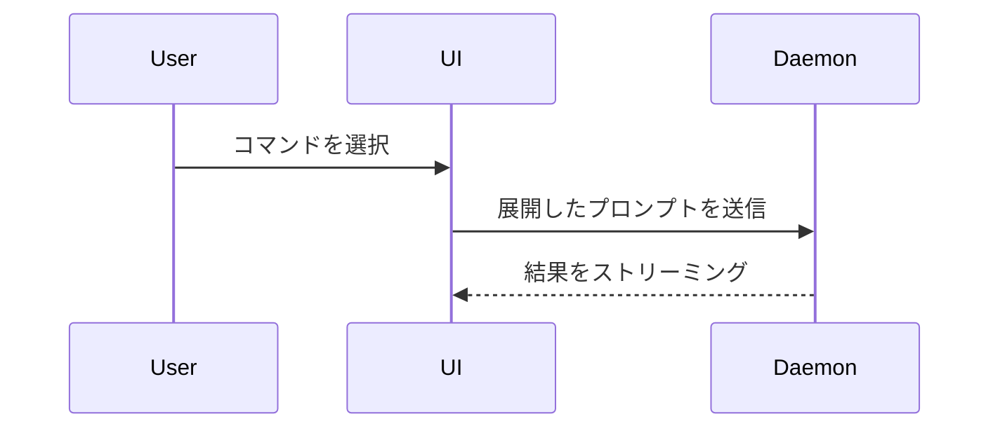

現在の話題を視覚的に理解できるように説明する。前置きは省き、文章は短くする。
要点が明確になる最小限の表現を選ぶ。

- ロジックやアルゴリズムは疑似コードで示す。

```text
on(save)
  if content is unchanged
    return cached result
  write new content
  return fresh result
```

- 実行時の制御フローはコールツリーで示す。

```text
submitForm
  createSession
    persistPrompt
    launchAgent
  navigateToSession
```

- UI構造はコンポーネントツリーで示し、重要な状態やモジュール境界を含める。

```tsx
<SessionPage> (apps/example/src/routes/session.tsx)
  useSessionEvents()
  <SessionToolbar>
    <RunSkillButton> (packages/ui)
```

- ファイルの責務や広範なリファクタリングは、浅いファイルツリーで示す。

```text
src/
├── commands/       # ユーザー操作を解析
├── sessions/       # セッション状態を管理
└── transport/      # APIリクエストを送信
```

- コンポーネント間の連携、制御フロー、データフローは Mermaid で示す。



- 既存構造に対する変更点が主題なら `diff` を使う。主題に合う差分形式を選ぶ。

コンポーネント変更の場合:

```diff
 <SessionPage>
   useSessionEvents()
   <SessionToolbar>
+    <RunSkillButton />
   <SessionTimeline>
+    <SkillResultCard />
```

ファイル構成変更の場合:

```diff
 src/
 ├── commands/
+│   └── show-me.ts       # スラッシュコマンドを展開
 ├── sessions/
-└── transport.ts
+└── transport/
+    ├── client.ts
+    └── stream.ts
```

コールツリーやコールスタック変更の場合:

```diff
 submitForm
   createSession
     persistPrompt
+    expandSkillMention
     launchAgent
-  navigateToSession
+  navigateToSession
+    subscribeToEvents
```

状態や制御フロー変更の場合:

```diff
 on(save)
-  write content
+  if content is unchanged
+    return cached result
+  write new content
+  invalidate cache
```

- 大部分が新規の場合、文脈を省くと責務や順序が不明になる場合、またはコピー可能な
  完成形が必要な場合は、ブロック全体を示す。

```ts
function expandSkill(command: string): string {
  const skillName = command.slice(1)
  return `use the ${skillName} skill`
}
```

- 視覚的なUI、レイアウト、状態比較、または Mermaid では密になりすぎる概念には、
  図、インフォグラフィック、短いスライドのいずれかに絞ったHTMLファイルを1つ作る。
  製品の色、書体、余白、コンポーネントに合わせ、代表的なラベルと無害化したデータを
  使用し、デスクトップとモバイルの両方に対応する。その後、利用可能なブラウザーまたは
  ファイル表示ツールでユーザーに提示する。

## HTML資料の安全規則

- 保存先の明示指定がなければワークスペースルートの `.agents/artifacts/<topic>/<YYYY-MM-DD-slug>/index.html` に保存する。PDFと関連資産も同じ成果物フォルダーにまとめる。既存資料は自動移動しない。閲覧と索引は [成果物エクスプローラー](../../artifact-explorer/README.md) を参照する。

- 秘密情報、認証情報、トークン、個人情報、顧客データ、または説明に不要な非公開の
  ソース内容を含めない。
- 資料は自己完結かつオフラインで動作させる。外部のスクリプト、スタイル、フォント、
  画像、フレーム、解析サービスなどのネットワークリソースを読み込まない。
- ユーザーが対話機能を明示的に求め、実現に必要な場合を除き、JavaScript、イベント
  ハンドラー属性、フォーム、ダウンロード、画面遷移を含めない。
- ラベルやソース由来の文字列は信頼できない入力として扱い、HTMLエスケープする。
- 内容が分かる名前で新規ファイルを作成する。ユーザーの明示的な許可なく既存ファイルを
  上書きしない。
- 非公開のプロジェクト情報を含む資料は、開く前にユーザーへ確認する。

## 表示方針

各図は、それを補足する短い文章の近くに置く。現在の質問や議論中の選択肢に答えるために
必要な呼び出し、ファイル、プロパティ、状態、境界だけを含める。

上記の表現は1つだけでも複数でもよいが、通常はすべてを使う必要はない。情報量が過剰に
ならないよう判断する。

## 出典

HumanLayer の `show-me` Skill（コミット
`6ab9013a10c28f5046f7f999549cd5328a0b30d7`）を基に、日本語化とHTML資料向けの
安全規則を追加している。ライセンスは同じディレクトリの `LICENSE` を参照する。